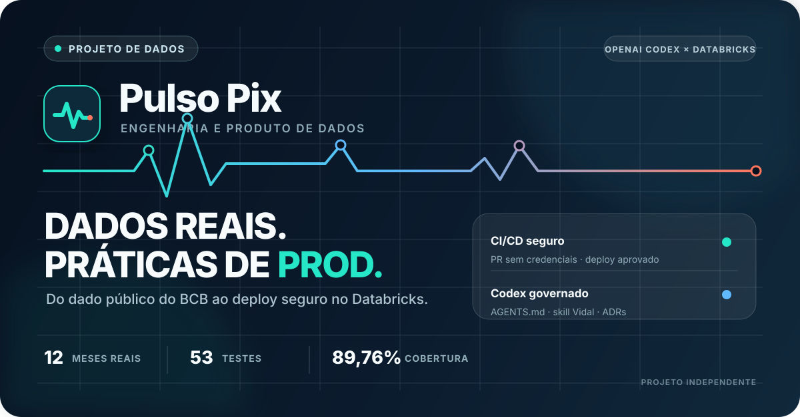
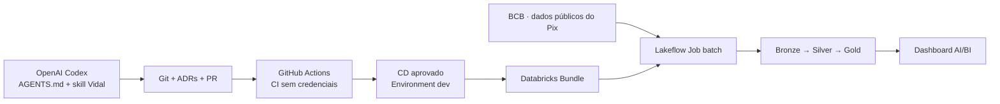

# Pulso Pix

[](https://github.com/lucasvidalsilva/projeto-pulso-pix-databricks/actions/workflows/ci.yml)
[](https://github.com/lucasvidalsilva/projeto-pulso-pix-databricks/actions/workflows/cd.yml)

Projeto brasileiro de engenharia e produto de dados sobre o Pix, construído com participação ativa de Vidal e apoio do Codex.

**Estado:** primeira entrega técnica implantada e validada no Databricks Free Edition. O projeto ingere as estatísticas mensais do Pix de 2025, preserva as respostas brutas, publica Silver e Gold em Delta e apresenta o resultado em um dashboard AI/BI.

O projeto prioriza dados úteis, escolhas explicáveis e evidência. Streaming, simulador e ML só entram com problema real que justifique seu uso.

- [Mapa do projeto](docs/mapa-do-projeto.md): funcionamento, evolução, decisões e resultados.
- [Instruções de desenvolvimento](AGENTS.md): método, ambiente, Git e Databricks.
- [Decisões arquiteturais](docs/decisoes): fontes, batch, armazenamento, orquestração, Gold e dashboard.
- [Política de segurança](SECURITY.md): credenciais, vulnerabilidades e desenvolvimento assistido.
- [Texto para o LinkedIn](docs/divulgacao/post-linkedin.md): narrativa, evidências e limites da publicação.

## Arquitetura da entrega



## Entrega atual

- Fonte real: `EstatisticasTransacoesPix`, do Banco Central do Brasil.
- Recorte: competências `202501`–`202512`.
- Bronze: respostas imutáveis no Volume `workspace.bronze.respostas_pix`.
- Silver: `workspace.silver.estatisticas_transacoes`, com 163.161 linhas no grão integral da fonte.
- Gold: `workspace.gold.uso_pix_mensal`, com 16.496 combinações mensais reconciliadas com a Silver.
- Consumo: [dashboard Pulso Pix — uso em 2025](https://dbc-6f6e2ab0-1349.cloud.databricks.com/dashboardsv3/01f1c0dca5481bbc9007062a6b7297b7/published?w=7474650652244145).

Os números são evidências estruturais do recorte validado e não demonstram causalidade nem representam transações individuais.

## Ambiente

Python 3.11+, Git, uv, Codex CLI e Databricks CLI atual. Instalar pelo guia oficial do sistema operacional; não usar o pacote legado `databricks-cli` do pip. Configuração completa e links estão no AGENTS.md.

```bash
uv sync --group dev
uv run ruff check .
uv run ruff format --check .
uv run pytest tests/unitarios
```

O `uv.lock` está versionado. O workflow de CI reproduz a instalação, o lint, a formatação e os testes unitários sem acessar ou implantar no workspace; o CD permanece separado.

O CI também exige cobertura mínima de 85%, constrói o wheel e verifica se código e SQLs
produtivos estão empacotados. O CD é separado: somente depois de um CI aprovado em `main`, o
GitHub Environment `dev` libera um PAT temporário para os comandos Databricks. O workflow
valida `dev` e `prod`, implanta apenas `dev` e permite um smoke end-to-end manual para evitar
consumir quota e depender da API do BCB em cada merge.

```bash
databricks aitools install --agents codex --scope global --skills-only
databricks auth login --host https://SEU-WORKSPACE --profile PULSO_PIX
databricks current-user me --profile PULSO_PIX
codex
```

No Codex, conferir `/skills` e solicitar a leitura do `AGENTS.md` e da skill Vidal antes de alterar arquitetura ou dados.

## Ambientes

O Databricks Free Edition disponível não permite criar os catálogos inicialmente propostos. Por decisão registrada, os dados reais usam o catálogo gerenciado `workspace`, com schemas `bronze`, `silver` e `gold`, somente no target `dev`.

O target `prod` existe para validar configuração, mas resolve zero recursos e não representa infraestrutura produtiva nem SLA. Validar explicitamente os dois targets:

```bash
databricks bundle validate --strict -t dev --profile PULSO_PIX
databricks bundle validate --strict -t prod --profile PULSO_PIX
```

Deploy e execução manual em `dev`:

```bash
databricks bundle deploy -t dev --profile PULSO_PIX
databricks bundle run estatisticas_pix -t dev --profile PULSO_PIX --params ano_mes=202501
```

## Desenvolvimento assistido e governado

O Codex atua como agente de desenvolvimento, não como componente do pipeline de dados. O
`AGENTS.md` define autonomia, checks e limites; a skill Vidal mantém o método reutilizável; e
os ADRs registram as decisões arquiteturais tomadas por Vidal. Código assistido passa pelos
mesmos testes, revisão e CI que qualquer outra contribuição, sem credenciais em prompts,
arquivos ou logs.

OpenAI, Codex e Databricks são marcas de seus respectivos proprietários. Este é um projeto
independente e não implica parceria, patrocínio ou endosso dessas empresas.
