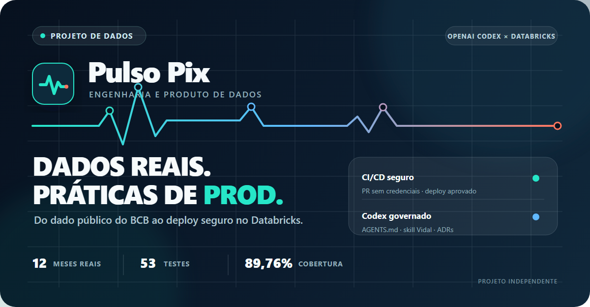

# Post para o LinkedIn

Status: rascunho pronto. Publicar depois de o workflow de CD concluir a primeira execução remota em `dev`, para que todas as afirmações abaixo estejam sustentadas por evidência.

## Texto

Eu não queria fazer só mais um projeto que termina em um notebook.

Queria pegar dados públicos reais, colocar um pipeline para rodar no Databricks e conseguir explicar cada decisão. Foi assim que nasceu o Pulso Pix.

O projeto processa as estatísticas mensais do Pix publicadas pelo Banco Central:

- 12 competências de 2025;
- 163.161 linhas validadas na Silver;
- 16.496 combinações mensais na Gold;
- reconciliação sem diferença entre Silver e Gold no recorte validado.

Na parte de engenharia, construí ingestão batch parametrizada, preservação do bruto, qualidade de dados, transformações em SQL, tabelas Delta e um dashboard AI/BI. A infraestrutura e o Job estão versionados com Databricks Declarative Automation Bundles.

Também estruturei CI/CD com GitHub Actions:

- CI sem credenciais em pull requests;
- dependências travadas e Actions fixadas por commit;
- lint, formatação, 53 testes e cobertura mínima de 85%;
- deploy em `dev` protegido por GitHub Environment;
- segredo liberado apenas nas etapas que chamam o Databricks;
- commit implantado registrado nas tags do Job.

Usei o OpenAI Codex durante o desenvolvimento, mas não como um botão que decide tudo sozinho. O AGENTS.md define a autonomia e os limites do agente, uma skill versionada mantém meu método de engenharia e os ADRs registram as decisões de arquitetura que ficaram comigo.

Para mim, esse é o ponto mais interessante do projeto: usar IA para acelerar a execução sem abrir mão de rastreabilidade, revisão e responsabilidade técnica.

Um limite que fiz questão de deixar claro: estou usando o Databricks Free Edition. O target prod é validado pelo bundle, mas não representa uma infraestrutura produtiva com SLA. O deploy real fica restrito a dev.

Prod aqui é disciplina de engenharia, não um ambiente inventado para deixar o projeto mais bonito.

Código: https://github.com/lucasvidalsilva/projeto-pulso-pix-databricks

Dashboard: https://dbc-6f6e2ab0-1349.cloud.databricks.com/dashboardsv3/01f1c0dca5481bbc9007062a6b7297b7/published?w=7474650652244145

#EngenhariaDeDados #Databricks #DataEngineering #GitHubActions #CICD #OpenAICodex #Pix #DadosAbertos

## Intenção da escrita

- Primeira pessoa, direta e sem linguagem de propaganda.
- Mostra números somente onde já há evidência registrada.
- Explica o papel do Codex sem transferir a ele as decisões de arquitetura.
- Usa “prod” como disciplina de engenharia e explicita a limitação da Free Edition.
- Não sugere parceria, patrocínio ou endosso de OpenAI ou Databricks.
